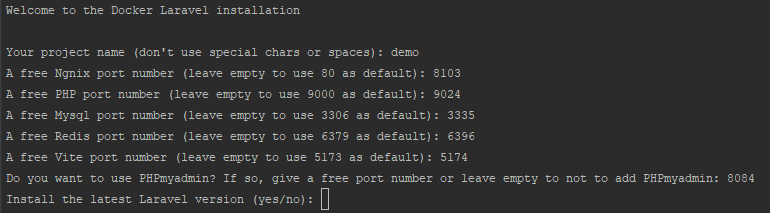
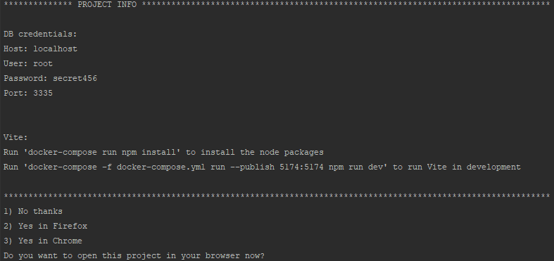

# Docker Laravel


This repo will help you to setup a Docker project and it will (optionally) install the latest version of Laravel with the help of an installation (shell script) wizard.  
What it will do:
* The wizard will ask you some questions and then it will generate the Docker files for you
* Starting the Docker containers
* Installation of the latest Laravel version (optional)
* * Update the .env file from the wizard answers
* * Add config for Vite
* * Ask if you want to install assets (Vue JS / Tailwind / AlpineJS) + the setup config files for them + a blade demo file
* * Shows you information how to use Vite for development + the database credentials information
* * Ask if you want to open the project in your browser (Chrome / Firefox)
* Removes the .git directory, .gitignore, installation stubs and installation wizard

----

# Usage

Create a directory where you want to use this Docker Laravel project.  
Go with the CLI into this directory.

* Clone this repo: ```git clone git@github.com:mvd81/docker-laravel.git .```
* Run the installation wizard: ```sh install.sh```


----

# Screenshots

#### Port config


#### Asset installation


#### Project information after the installation


-----

# Docker-compose containers

* Nginx
* PHP
* Mysql
* Node JS
* Composer
* Redis
* PHPmyadmin (optional)

----

# Changelog

## [v2.1] - 2022-08-12

* Add option to install assets (Vue JS / Tailwind / AlpineJS) 

## [v2.0] - 2022-08-03

* Add an installation wizard, which makes it even easier to setup a Laravel project with Docker (you don't have to manually change the docker-compose file, run the command to install Laravel, start the containers and open the project in your browser)
* Update docker-compose for the latest Laravel installation
* Config for Vite
* Add the function (optional) to add PHPmyadmin

## [v1.0] - 2022-03-02
* docker-compose template file

